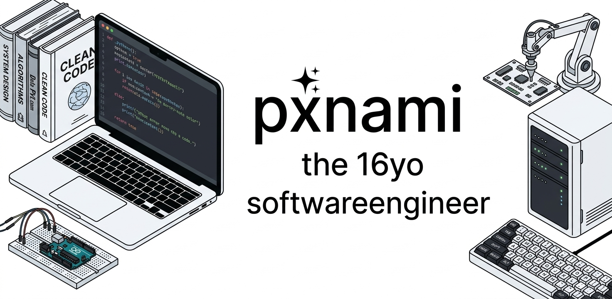

  

 

## about

16-year-old self-taught software engineer. I build most of my projects from the ground up, on my own, and learn primarily by shipping things rather than studying theory first. I'm the founder of two independent projects: DoNext, a focused to-do list app, and Greenchess, a free and open-source chess platform. I care about clean, usable software that's free for real people to use.

📧 contact.pxnami@gmail.com

## core skills

<table>
<tr>
<td valign="top" width="65%">
<strong>I build with</strong>  

 HTML (full) · CSS (full) · Java (beginner)
</td>
<td valign="top" width="35%">
<strong>Currently learning</strong>  

 Lua · UI design in Figma
</td>
</tr>
</table>

## featured projects

<table>
<tr>
<td width="50%" valign="top">
<h3><a href="https://github.com/pxnami/greenchess">Greenchess</a></h3>
<strong>Free & open-source chess</strong>  
A player-first chess platform inspired by the usability of chess.com, built to be free, open-source, and independently developed.
</td>
<td width="50%" valign="top">
<h3>DoNext</h3>
<strong>A focused to-do list app</strong>  
A clean app for turning plans into completed tasks — built as an independent project, founded and developed solo.
</td>
</tr>
</table>

## how i work

- I build independently, from the first idea through the finished product.
- I'm learning Lua and picking up UI/UX design in Figma to design my own interfaces before coding them.
- I care about simple experiences, useful software, and open-source work.

  Thanks for visiting my profile.

