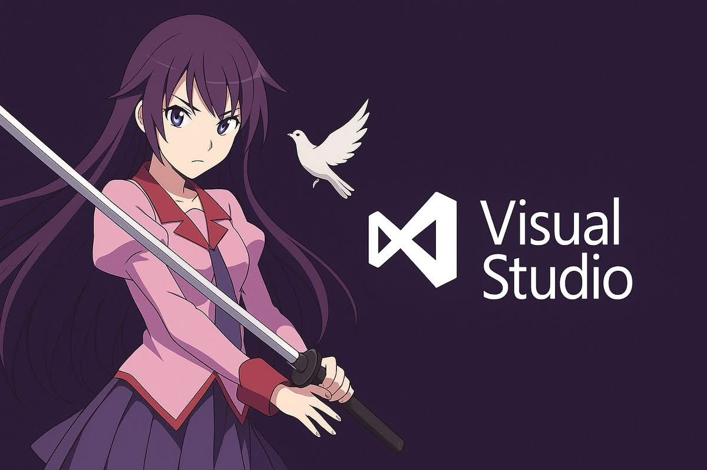

  

 

## about

16-year-old self-taught software engineer. I build most of my projects from the ground up, on my own, and learn primarily by shipping things rather than studying theory first. I'm the founder of four independent projects: DoNext, GreenChess, Notability Tracker, and Revora. I care about clean, usable software that's free for real people to use.

📧 contact.pxnami@gmail.com · 🌐 [pxnami.github.io](https://pxnami.github.io/)

## core skills

<table>
<tr>
<td valign="top" width="46%">
<strong>Core languages</strong>  

 HTML · CSS · JavaScript · TypeScript · C#
</td>
<td valign="top" width="28%">
<strong>Additional experience</strong>  

 SQL/PostgreSQL · PowerShell · Bash
</td>
<td valign="top" width="26%">
<strong>Currently learning</strong>  

 Lua · Java · UI design in Figma
</td>
</tr>
</table>

## featured projects

<table>
<tr>
<td width="50%" valign="top">
<h3><a href="https://github.com/pxnami/GreenChess">GreenChess</a></h3>
<strong>Free & open-source chess</strong>  
A player-first chess practice platform inspired by the usability of chess.com, built to be free, open-source, and independently developed.  
<a href="https://github.com/pxnami/GreenChess">Repository</a> · <a href="https://pxnami.github.io/GreenChess/">Live website</a>
</td>
<td width="50%" valign="top">
<h3>DoNext</h3>
<strong>A focused to-do list app</strong>  
A clean app for turning plans into completed tasks — built as an independent project, founded and developed solo.
</td>
</tr>
<tr>
<td width="50%" valign="top">
<h3><a href="https://github.com/pxnami/Notability-Tracker">Notability Tracker</a></h3>
<strong>A source-backed Notability tracker</strong>  
An independent tracker for Notability bugs, documented fixes, feature requests, and development updates, with links to original sources.  
<a href="https://github.com/pxnami/Notability-Tracker">Repository</a> · <a href="https://pxnami.github.io/Notability-Tracker/">Live website</a>
</td>
<td width="50%" valign="top">
<h3><a href="https://github.com/pxnami/Revora">Revora</a></h3>
<strong>iPhone and iPad recovery utility</strong>  
A Windows desktop utility for recovery mode, device information, and compatible IPSW firmware installs. Currently in early development.  
<a href="https://github.com/pxnami/Revora">Repository</a>
</td>
</tr>
</table>

## how i work

- I build independently, from the first idea through the finished product.
- I'm learning Lua and picking up UI/UX design in Figma to design my own interfaces before coding them.
- I care about simple experiences, useful software, and open-source work.

  Thanks for visiting my profile.

